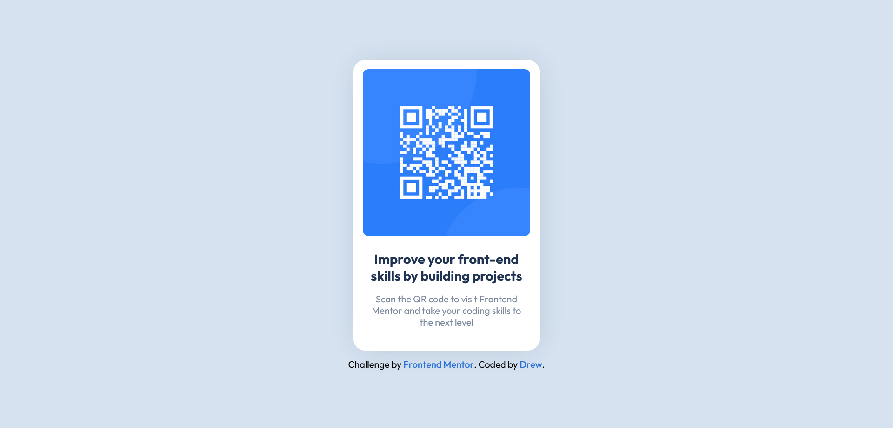

# Frontend Mentor - QR code component solution

This is a solution to the [QR code component challenge on Frontend Mentor](https://www.frontendmentor.io/challenges/qr-code-component-iux_sIO_H). Frontend Mentor challenges help you improve your coding skills by building realistic projects.

## Table of contents

- [Overview](#overview)
  - [Screenshot](#screenshot)
  - [Links](#links)
- [My process](#my-process)
  - [Built with](#built-with)
- [Author](#author)

## Overview

### Screenshot

### Links

- Solution URL: [Click here](https://github.com/24FContreras/FM-QR-Component)
- Live Site URL: [Click here](https://24FContreras.github.io/FM-QR-Component)

## My process

### Built with

- Semantic HTML5
- CSS
- Flexbox
- Sass (Scss)

## Author

- Frontend Mentor - [@24FContreras](https://www.frontendmentor.io/profile/24FContreras)
- Github - [24FContreras](https://github.com/24FContreras)
